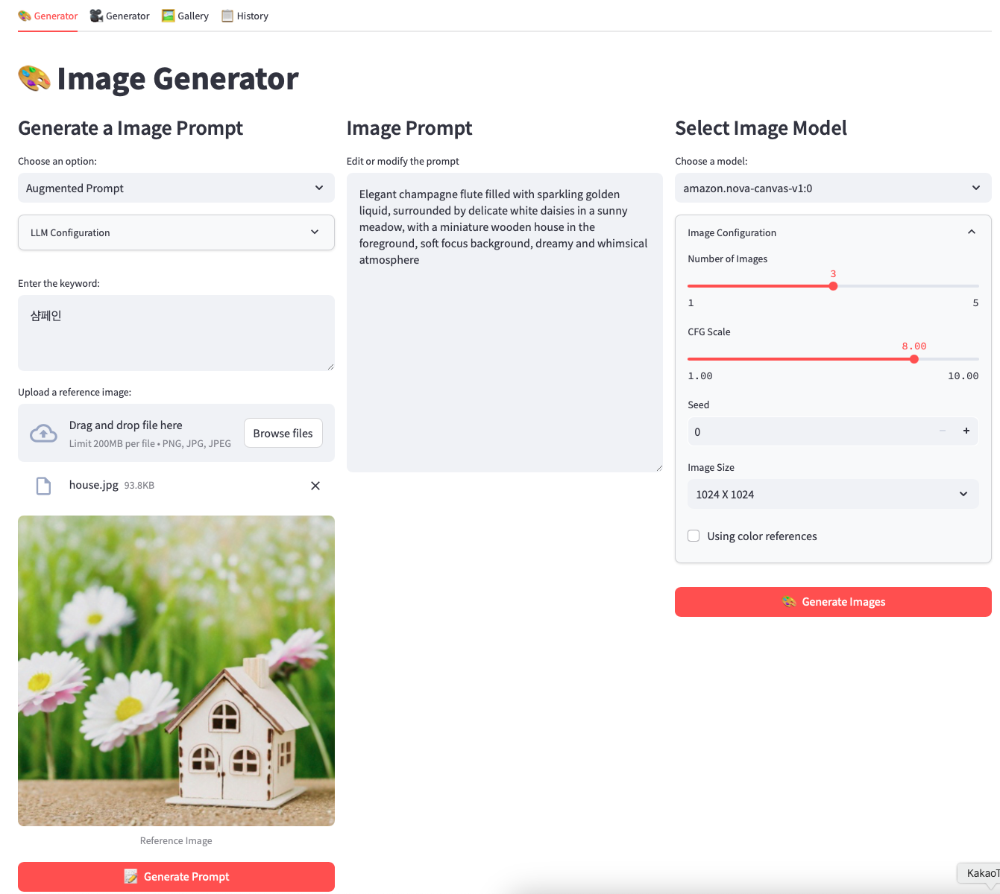
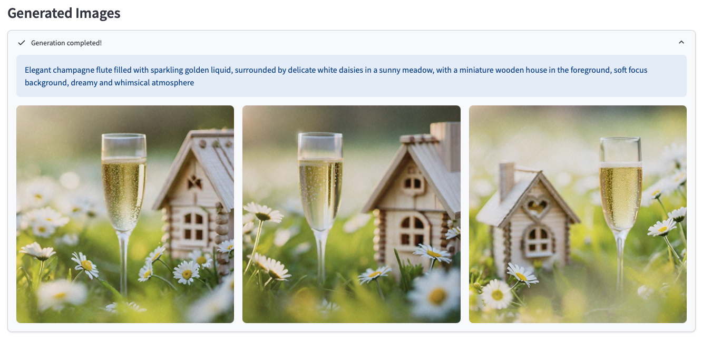
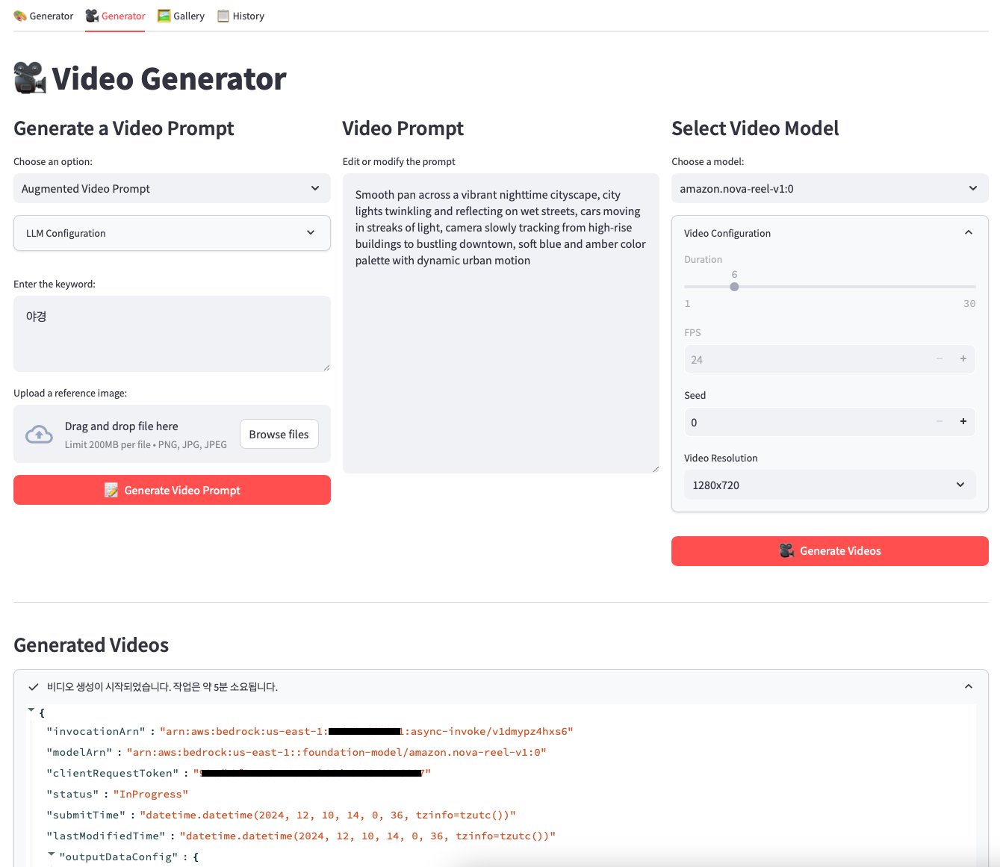
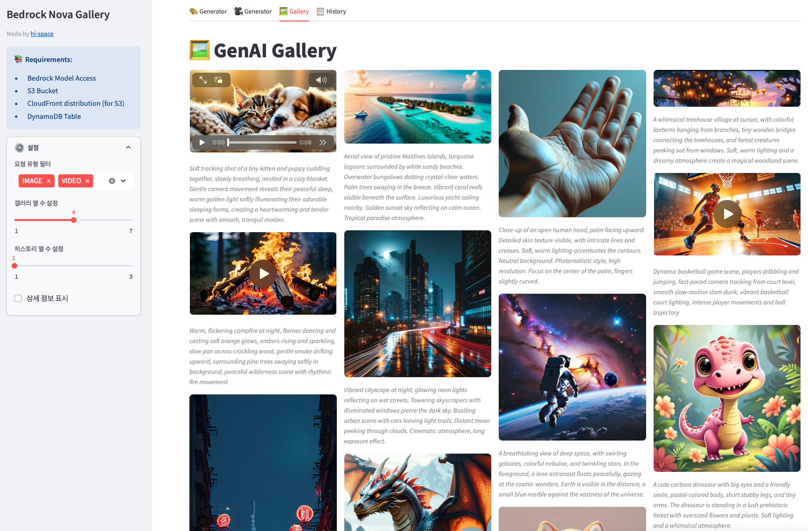
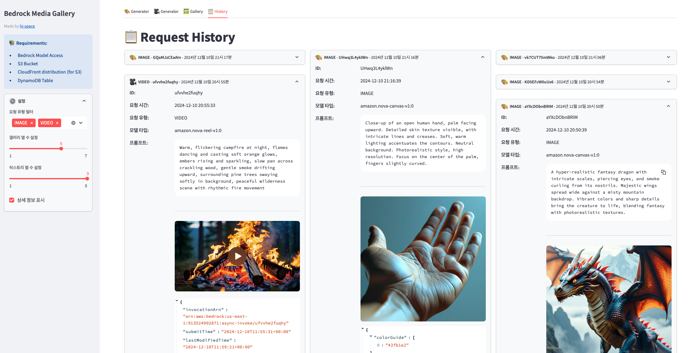
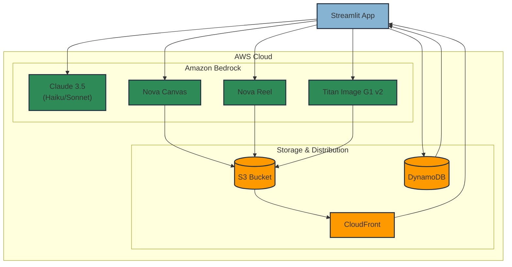
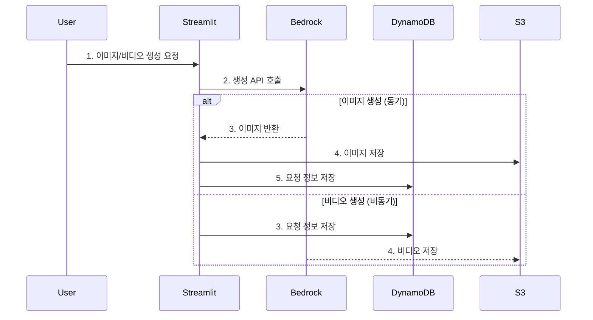
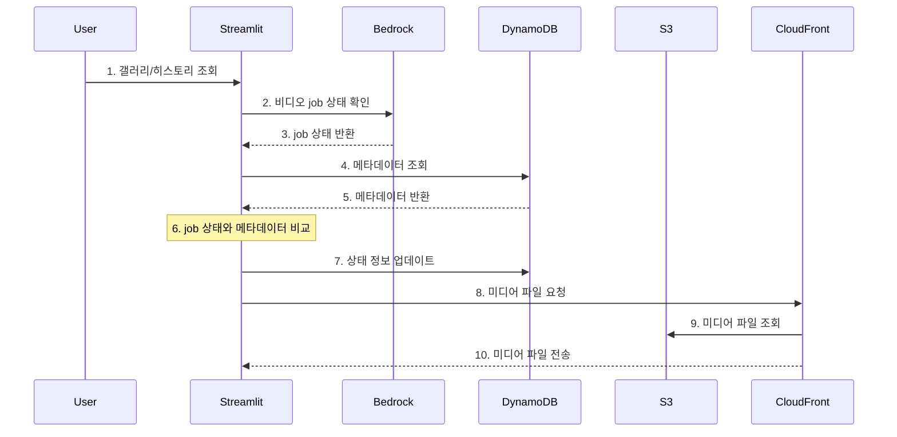

# Amazon Bedrock Nova Gallery

Amazon Bedrock의 생성형 AI 모델 Nova를 활용하여 이미지와 비디오를 생성하고 전시하는 애플리케이션입니다.

## 🌟 Features

- **이미지 생성**: Nova Canvas와 Titan image generation G1 v2 모델을 활용한 이미지 생성
- **비디오 생성**: Nova Reel을 활용한 비디오 생성 (24FPS, 6초, 1280x720 해상도)
- **갤러리 뷰**: 생성된 이미지와 비디오의 체계적인 전시
- **히스토리 추적**: 생성 요청 기록과 결과물 조회
- **LLM 기반 프롬프트**: Claude 모델을 활용한 프롬프트 개선

## 📱 사용자 인터페이스

애플리케이션은 4개의 주요 탭으로 구성되어 있습니다.

### 1. 이미지 생성기 - `Nova Canvas`, `Titan Imag Generator v2`

- LLM 기반 프롬프트 개선 (텍스트, 이미지)
  - `Basic Prompt`: 입력한 prompt를 영문으로 변경
  - `Augmented Prompt`: 입력한 prompt와 이미지를 기반으로 프롬프트 작성
- 실시간 이미지 생성 및 미리보기
- Nova Canvas와 Titan 모델 선택 가능




### 2. 비디오 생성기 - `Nova Reel`

- LLM 기반 프롬프트 개선 (텍스트, 이미지)
  - `Basic Prompt`: 입력한 prompt를 영문으로 변경
  - `Augmented Prompt`: 입력한 prompt와 이미지를 기반으로 프롬프트 작성
- 텍스트 기반 비디오 생성
- (이미지 + 텍스트) 기반 비디오 생성
  - Image-to-Video의 입력 이미지는 1280x720로 자동 resize (이미지 중앙 기준)
- 비동기 생성 프로세스
- 고정 해상도(1280x720) 및 길이(6초) 지원



### 3. 갤러리

- 생성된 모든 이미지와 비디오 전시
- CloudFront를 통한 최적화된 미디어 전송



### 4. 히스토리

- 생성 요청 기록 조회
- 상세 옵션 및 결과물 확인



## 🚀 How to Run

### 1. AWS 리소스 준비

- Amazon Bedrock 모델 접근 권한
  - Claude 3.5 (Haiku, Sonnet)
  - Nova Canvas
  - Nova Reel
  - Titan image generation G1 v2
- S3 버킷
- CloudFront 배포
- DynamoDB 테이블

### 2. 환경 변수 설정

**방법 1: 로컬 개발 환경**

- `.env.example`을 `.env`로 복사 후 설정:
  ```sh
  BEDROCK_REGION=us-east-1
  DYNAMO_TABLE=nova-gallery
  S3_BUCKET=nova-gallery-bucket
  CF_DOMAIN=https://abcdefg.cloudfront.net
  ```

**방법 2: AWS Secrets Manager 사용**

- `config.py`에서 `SECRET_NAME` 설정

### 3. 애플리케이션 실행

```sh
streamlit run app.py
```

## 🔄 Architecture / Workflow

### 시스템 아키텍처



### 이미지/비디오 생성 Flow



### 갤러리/히스토리 조회 Flow



## ⚠️ 주의사항

- CDK 배포 후 CloudFront OAC(Origin Access Control) 설정 확인 필요
- 필요한 모든 AWS 서비스에 대한 적절한 IAM 권한 확인
