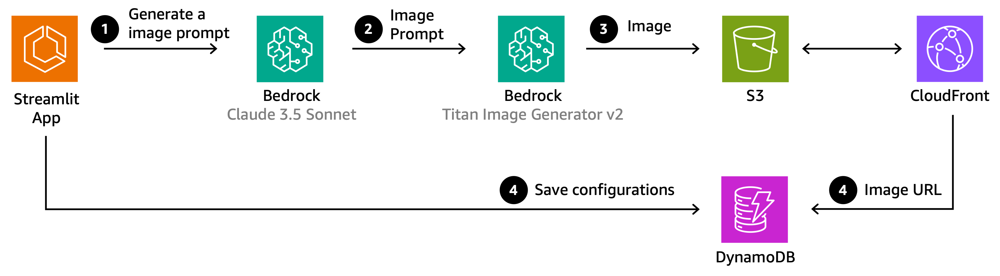
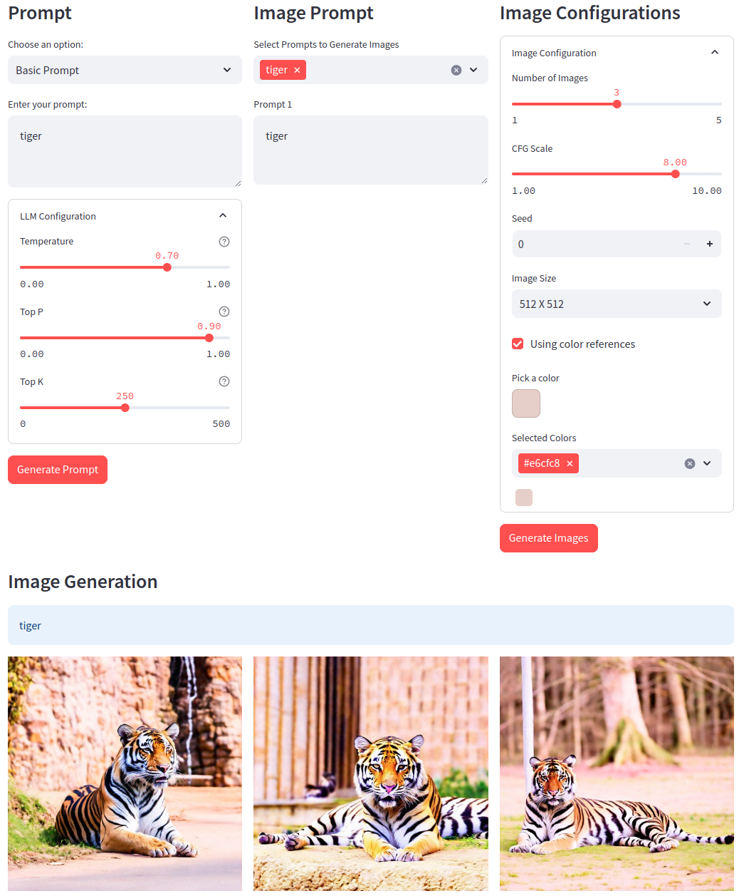
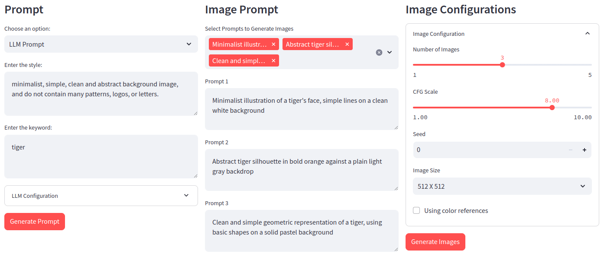
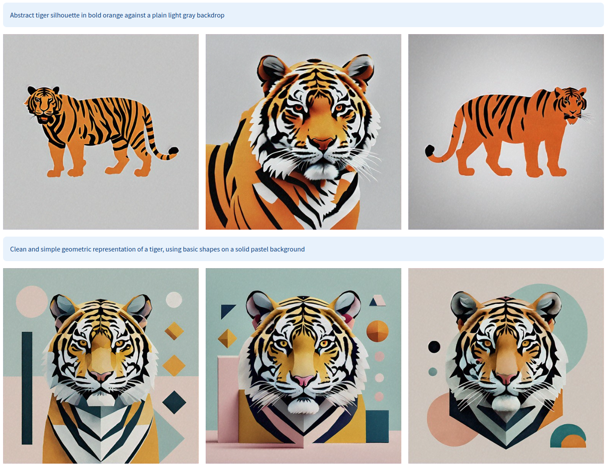
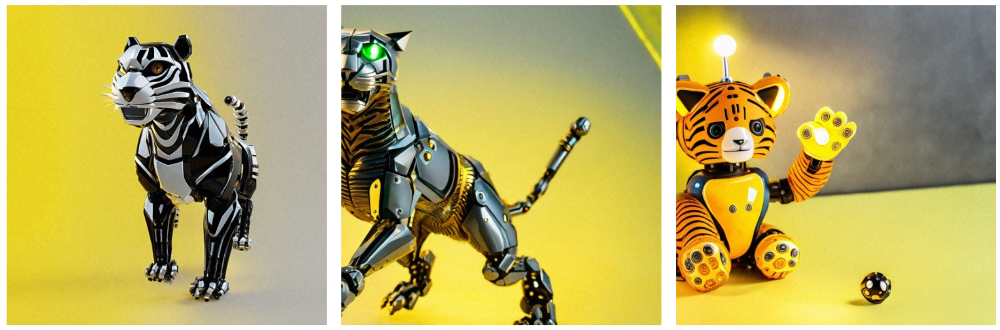

# Image Generation with Multimodal LLM

To generate desired images using image generation models, it's crucial to accurately describe the image details in the prompt. However, creating detailed prompts without prior information can be challenging. To assist with this, we propose creative image prompt ideas based on user-provided styles and keywords through Multimodal LLM. This allows users to generate image prompts more intuitively and reduce the effort required for prompt writing.

The image generation model used is [Amazon Titan Image Generator G1 v2](https://docs.aws.amazon.com/bedrock/latest/userguide/titan-image-models.html).

## Architecture



## Getting Started

1. Copy the `.env.example` file and rename to `.env` and fill with your configuration.

2. Python dependency modules can be installed with the following command

    ```sh
    pip install -r requirements.txt
    ```

3. Run an application

    ```sh
    streamlit run app.py
    ```

## Preview

### Basic Prompt

This is when using the basic image generation prompt. Since the system only supports English, it includes a process of translating the input prompt into English through the LLM.
By utilizing the `COLOR_GUIDED_GENERATION` feature of Titan Image Generator, images are created based on the set color palette.



### LLM Prompt

This is the result of generating prompts for Image Generation from LLM. When you input style and keyword values, it suggests 3 image prompts based on that information.

- `style`: desired mood or style
- `keyword`: keywords for the image you want to generate





### Multimodal LLM Prompt

Titan Image Generator offers several options for creating new images based on reference images:

- **Image Conditioning**: Generates images that match the layout and composition of the reference image while following text prompts. This may be limited to simply reconstructing existing images, restricting creative freedom.

- **Color Guided Generation**: Reflects the color tone of the image by receiving reference colors through a reference image. While it reflects some color tones, it's difficult to reflect the mood or texture of the image.

- **Image Variation**: Generates images that preserve the source image but transform the style and background. The range of variation is limited and there are constraints on the original image.

While these methods are useful for reflecting specific attributes of reference images (such as color, layout, source image, etc.), they have limitations in generating completely new images that reflect creative and complex features due to the restricted range of variations. Using a Multimodal LLM to understand reference images and generate prompts for creating target images allows for more free and creative image prompt generation.




### Imaeg Gallery

The generated images are stored in Amazon S3, while their CloudFront URLs and metadata are saved in DynamoDB. Users can view the generated images based on the stored data.


