# [Amazon Titan Image Generator v2](https://docs.aws.amazon.com/bedrock/latest/userguide/titan-image-models.html)

Amazon Titan Image Generator G1 is an image generation model. It enables users to generate and edit images in versatile ways. The model provides precise control over the prompt, reference images and color palette.

## Features

### Text-to-image (T2I) generation

Input a text prompt and generate a new image as output. The generated image captures the concepts described by the text prompt.

| Input                                                                                                                           | Output                          |
|---------------------------------------------------------------------------------------------------------------------------------|---------------------------------|
| Modern, high-end beach house interior with panoramic views of the sand and sea, emphasizing sleek design and uncluttered spaces | 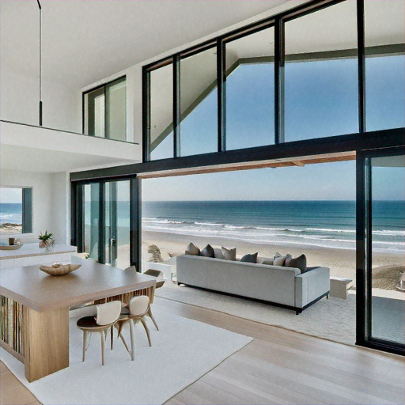 |

### Image variation

Uses 1 to 5 images and an optional prompt as input. It generates a new image that preserves the content of the input image(s), but variates its style and background.

| Input                                          |                Output                 |
|------------------------------------------------|:-------------------------------------:|
| 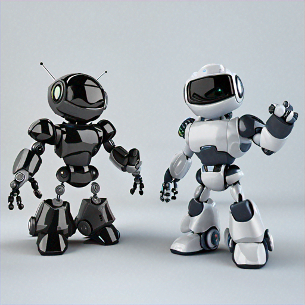 **[text]** Tiger | 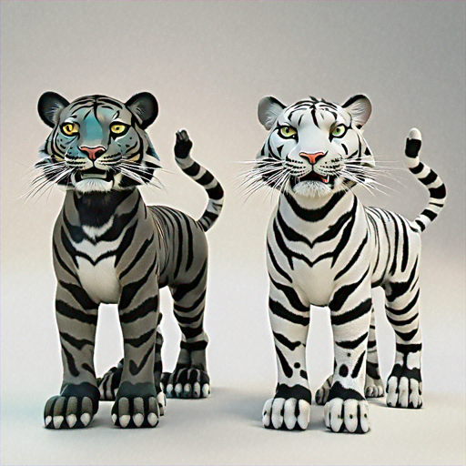 |

### Inpainting

Uses an image and a segmentation mask as input (either from the user or estimated by the model) and reconstructs the region within the mask. Use inpainting to remove masked elements and replace them with background pixels.

| Input                                                                                           |                Output                |
|-------------------------------------------------------------------------------------------------|:------------------------------------:|
| 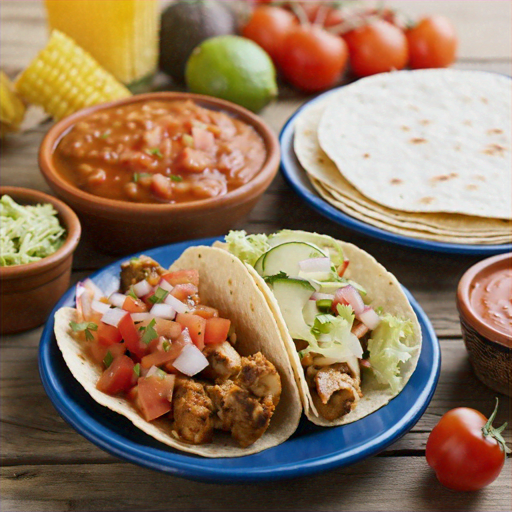 **[mask prompt]** bowl of salsa   **[text]** bowl of black beans | 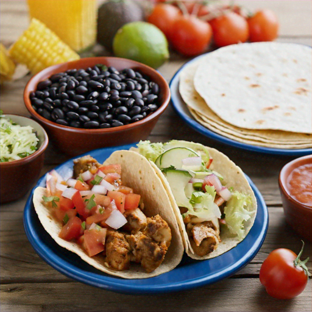 |

### Outpainting

Uses an image and a segmentation mask as input (either from the user or estimated by the model) and generates new pixels that seamlessly extend the region. Use precise outpainting to preserve the pixels of the masked image when extending the image to the boundaries. Use default outpainting to extend the pixels of the masked image to the image boundaries based on segmentation settings.

| Input                                                                                                 |                 Output                 |
|-------------------------------------------------------------------------------------------------------|:--------------------------------------:|
|  **[mask prompt]** laptop   **[text]** laptop on a granite countertop | 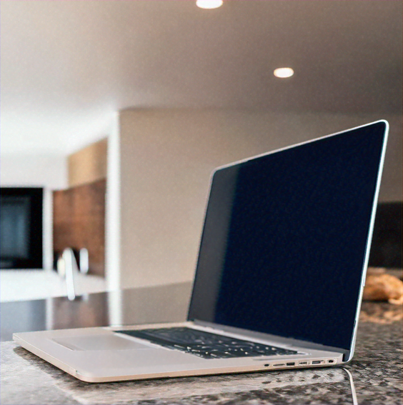 |

### Image conditioning (V2 only)

Uses an input reference image to guide image generation. The model generates output image that aligns with the layout and the composition of the reference image, while still following the textual prompt.

| Input                                                                   |                Output                 |
|-------------------------------------------------------------------------|:-------------------------------------:|
| 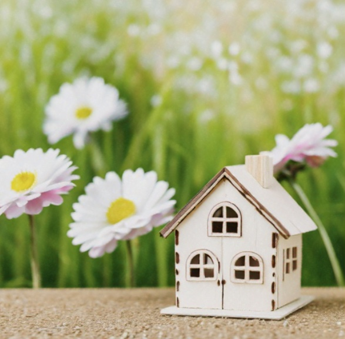 **[text]** A fairytale house in the forest | 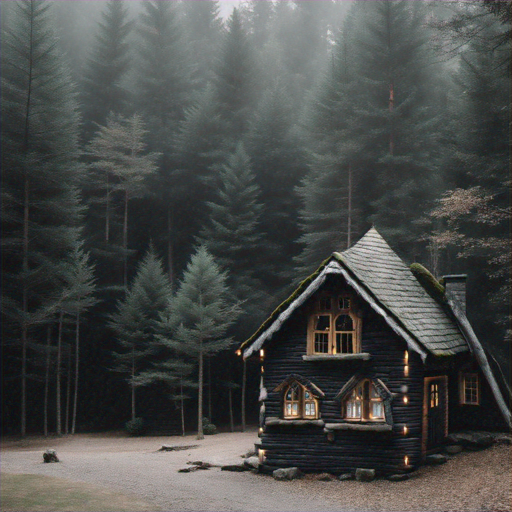 |

### Color guided content (V2 only)

You can provide a list of hex color codes along with a prompt. A range of 1 to 10 hex codes can be provided. The image returned by Titan Image Generator G1 V2 will incorporate the color palette provided by the user.

| Input                                                                                                                                                                                                                                                                                                                                                                                                             |                Output                 |
|-------------------------------------------------------------------------------------------------------------------------------------------------------------------------------------------------------------------------------------------------------------------------------------------------------------------------------------------------------------------------------------------------------------------|:-------------------------------------:|
| Modern, high-end beach house interior with panoramic views of the sand and sea, emphasizing sleek design and uncluttered spaces   **[colors]** #ff8080 #e5ff80 | 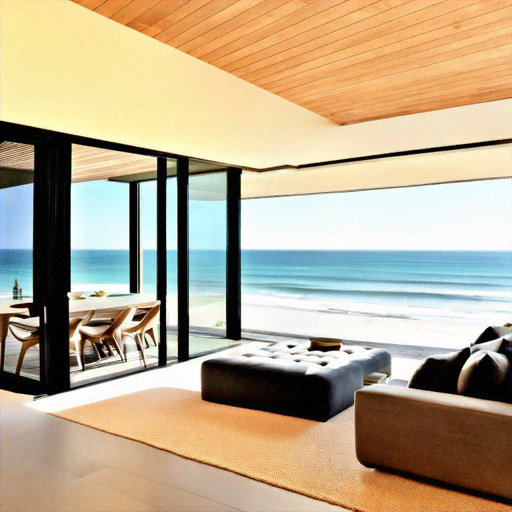 |

### Background removal (V2 only)

Automatically identifies multiple objects in the input image and removes the background. The output image has a transparent background.

| Input                         |                 Output                 |
|-------------------------------|:--------------------------------------:|
| 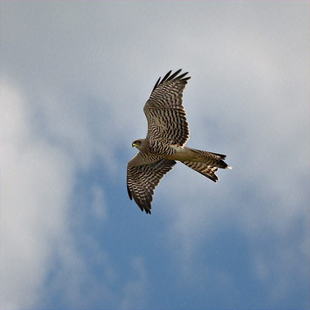 | 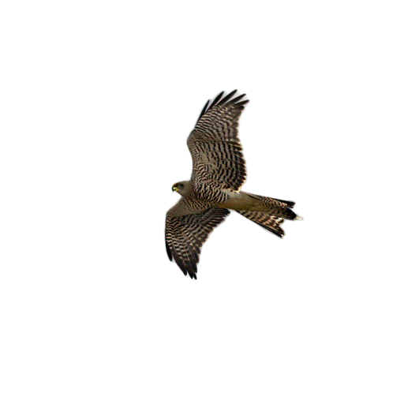 |
